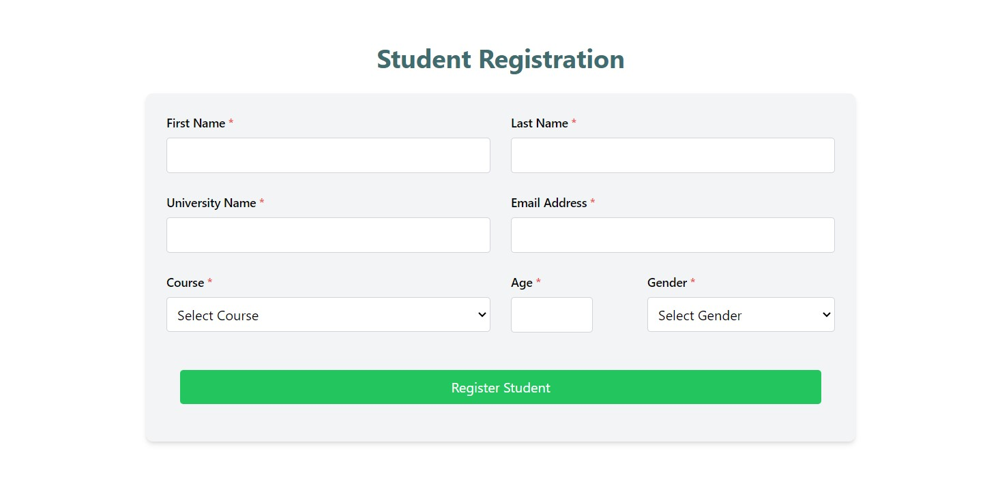
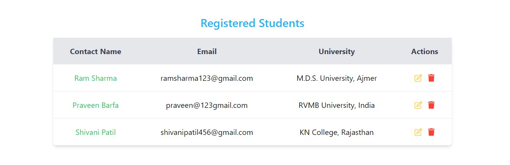

# Students Registration Form

This project is a web application for registering students, displaying their details, and providing features to edit, delete, and view individual student information. The application validates student input to prevent empty fields and duplicate student entries.

## Table of Contents

- [Features](#features)
- [Technologies Used](#technologies)
- [Form Validation](#form-validation)
- [Toast Notifications](#toast-notifications)
- [Live Demo](#live)
- [Screenshots](#screenshots)

## Features

- Add new student entries.
- **Edit student:** Edit student details by clicking the edit button.
- **Delete student:** Remove a student by clicking the delete button.
- **View student Details:** Click on the student's name to view student details.
- Validation to prevent empty fields and duplicate student entries.
- Toast notifications for student actions (success or error messages).
- **Responsive Design:** The table hides the "University" column on small screens (mobile view).

## Technologies Used

- **React:** JavaScript library for building the user interface.
- **Tailwind CSS:** Utility-first CSS framework for styling.
- **Font Awesome:** Icons for the action buttons (edit and delete).
- **Responsive Design:** The table layout adapts to different screen sizes, hiding certain columns on mobile.

## Live Demo

[Live Demo]()

## ScreenShots

